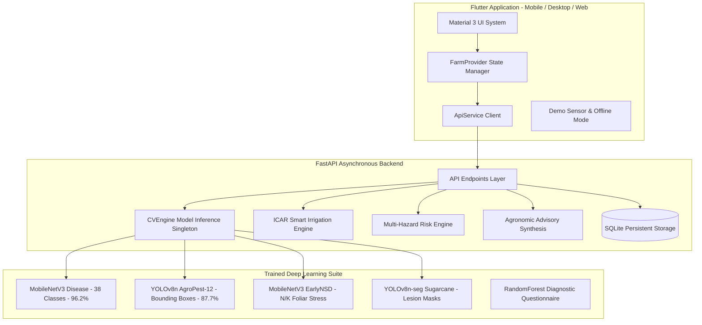

# AgriVyn — Technical Architecture Documentation

---

## 1. High-Level System Architecture

---

## 2. Frontend Layer (Flutter Material 3)

The user application is built using Flutter 3.41 with pure Material 3 styling and responsive design.

### Directory Layout
- `lib/core/`:
  - `theme.dart`: Color tokens, GoogleFonts Outfit & Inter typography, elevation tokens, CardThemeData.
  - `constants.dart`: Supported crops, stages, soil profiles, API endpoints.
  - `api_service.dart`: HTTP REST client with multipart streaming and fallback offline modes.
- `lib/models/`: Strongly typed Dart data models (`scan_result.dart`, `farm_summary.dart`, `irrigation_result.dart`, `environment_result.dart`).
- `lib/providers/`: `FarmProvider` state manager coordinating scans, IoT streams, analytics, and demo mode.
- `lib/widgets/`:
  - `metric_card.dart`: Reusable KPI card with status indicators and icon badge.
  - `bounding_box_painter.dart`: CustomPainter projecting YOLO coordinates onto arbitrary image dimensions.
  - `demo_mode_banner.dart`: Persistent compliance banner distinguishing live IoT vs simulated inputs.
- `lib/screens/`: 10 production screens (Home Dashboard, AI Scan, AgroPest, Nutrient, Irrigation, Environment, Analytics, History, Model Cards, 3-Min SIH Quick Demo).

---

## 3. Backend Layer (FastAPI Asynchronous Microservice)

- **Runtime**: Python 3.14 on Uvicorn ASGI server.
- **ORM & Database**: SQLAlchemy 2.0 async engine with SQLite database (`data/agrivyn.db`).
- **Database Schema**:
  - `farms`: Farm name, location, total acreage, soil profile.
  - `fields`: Field name, crop, variety, stage, soil type.
  - `sensor_readings`: Real-time and demo IoT telemetry logs (soil moisture, temperature, humidity, rainfall, timestamp, `is_demo`).
  - `scan_results`: Crop, predictions, confidence, pest JSON, nutrient stress, lesion %, advisory notes, image path.
  - `alerts`: Severity (HIGH / MODERATE / LOW), action needed, resolution status.

---

## 4. Computer Vision Inference Pipeline (`cv_service.py`)

1. **Validation**: Enforces image dimensions (minimum 64×64, maximum 4096×4096), supported formats (`JPEG`, `PNG`, `WEBP`), and RGB channel normalization.
2. **Crop Disease Inference**:
   - Resized to 224×224, normalized with ImageNet stats.
   - Forward pass through `MobileNetV3-Small`.
   - Softmax normalization yielding 38-class probability distribution.
   - Confidence tiering: High ($\ge 0.75$), Moderate ($0.50 - 0.75$), Uncertain ($< 0.50$).
3. **AgroPest Object Detection**:
   - Forward pass through `YOLOv8n` at 416×416 input resolution.
   - Extracts bounding boxes $[x_1, y_1, x_2, y_2]$, class IDs, and confidence scores.
   - Aggregates pest frequency and determines Infestation Risk:
     - $\ge 8$ pests: HIGH
     - $2 - 7$ pests: MODERATE
     - $0 - 1$ pests: LOW
4. **EarlyNSD Foliar Analysis**:
   - Evaluates Nitrogen deficiency (generalized lower leaf chlorosis) and Potassium deficiency (marginal edge necrosis).
5. **Unified Multi-Model Scan**:
   - Orchestrates Disease + Pest + Nutrient + Lesion Area into a consolidated diagnosis and writes record to SQLite.

---

## 5. Agronomic Intelligence Formulation

### 5.1 Smart Irrigation Math
Evapotranspiration and depletion:
$$ET_c = ET_0 \times K_c$$
$$\text{Water Deficit \%} = \frac{\theta_{\text{target}} - \theta_{\text{measured}}}{\theta_{\text{target}}} \times 100$$
$$\text{Recommended Duration (mins)} = \text{round}\left(\text{Deficit \%} \times 2.8 \times \text{Sensitivity Factor}\right)$$

Where:
- $\theta$: Root zone volumetric soil moisture (%).
- $K_c$: Crop coefficient calibrated by phenological growth stage (e.g. $K_c = 1.15$ during flowering/fruiting; $K_c = 0.60$ during initial vegetative stage).

### 5.2 Environmental Risk Engine
Evaluates 4 risk vectors independently and synthesizes a Compound Environmental Stress Index:
$$\text{Compound Risk} = 0.35 \times R_{\text{drought}} + 0.25 \times R_{\text{heat}} + 0.20 \times R_{\text{flood}} + 0.20 \times R_{\text{disease}}$$
If rain $\ge 25\text{ mm}$ or humidity $\ge 80\%$, disease favorable risk is triggered due to high fungal spore germination probability.
