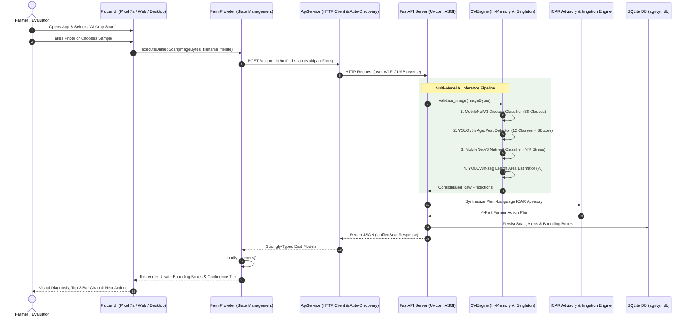
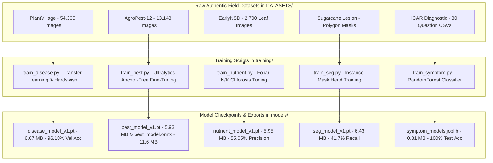
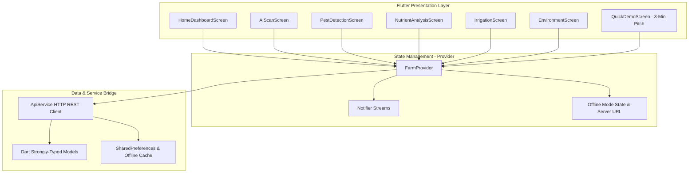
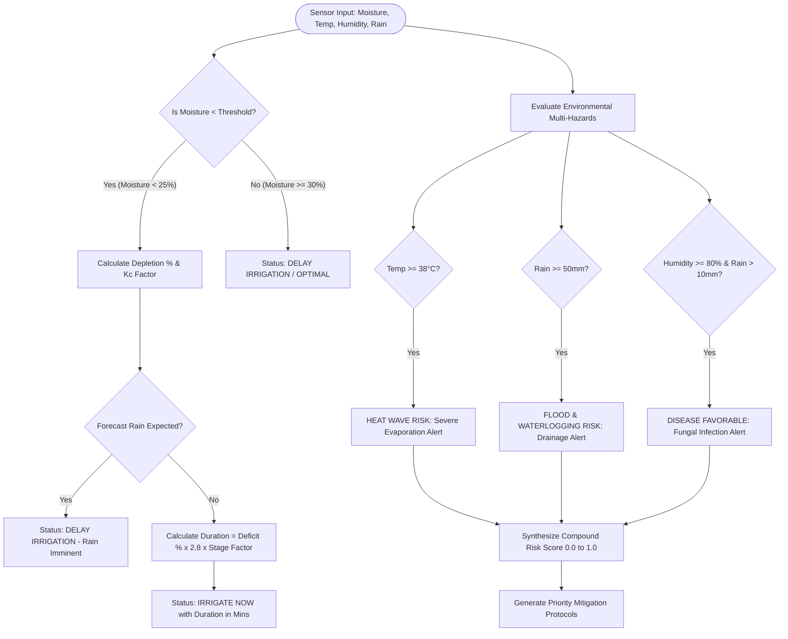
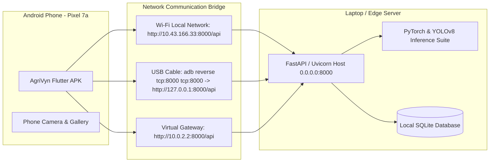

# AgriVyn — Complete System Flow & Build Architecture
**SIH 2026 Problem Statement ID: 26180**

This document details the architectural and procedural flow diagrams of how the AgriVyn application is built, trained, connected, and executed across mobile devices and edge servers.

---

## 1. End-to-End Application Runtime Flow

---

## 2. Deep Learning Models Build & Training Flow

---

## 3. Frontend Architecture (Flutter MVVM + Provider)

---

## 4. Smart Irrigation & Multi-Hazard Weather Risk Engine Flow

---

## 5. Physical Mobile Device Network Architecture

